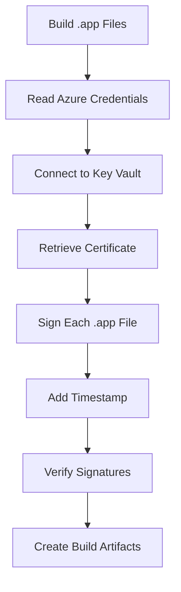

## Overview

Code signing is a critical security practice that ensures the authenticity and integrity of your Business Central apps. As of June 1st, 2023, industry standards require code signing certificates to be stored on Hardware Security Modules (HSM) or FIPS 140-2 Level 2 certified hardware tokens.

AL-Go for GitHub uses Azure Key Vault to securely store code signing certificates and .NET Sign to sign application files.

<Note>
  This guide assumes you have already set up your AL-Go project with Azure Key Vault for secrets management. If you haven't, first follow the [Use Azure KeyVault for secrets with AL-Go](https://github.com/microsoft/AL-Go/blob/main/Scenarios/UseAzureKeyVault.md) scenario.
</Note>

## Why Azure Key Vault?

Since June 1st, 2023, Certificate Authorities issue code signing certificates only through:
- Physical USB tokens
- On-premises HSM services  
- Cloud HSM services (such as Azure Key Vault)

Azure Key Vault provides:
- **FIPS 140-2 Level 2 compliance**: Premium SKU supports HSM-backed certificates
- **Cloud accessibility**: Sign code from GitHub Actions without physical tokens
- **Certificate lifecycle management**: Automated renewal and rotation
- **Access control**: Fine-grained permissions via RBAC or vault policies
- **Audit logging**: Track all certificate usage

<Warning>
  If your code signing certificate was issued after June 1st, 2023, you will most likely need to create a **Premium SKU** Key Vault. [Learn more about Standard vs Premium SKU](https://azure.microsoft.com/en-us/pricing/details/key-vault/).
</Warning>

## Prerequisites

<Steps>
  <Step title="Azure Subscription">
    An active Azure subscription with permissions to create Key Vaults and manage certificates.
  </Step>
  
  <Step title="AL-Go Repository">
    A GitHub repository configured with AL-Go for GitHub (preferably the AppSource template).
  </Step>
  
  <Step title="Azure Key Vault Setup">
    Complete the Azure Key Vault setup for AL-Go by following the [Use Azure KeyVault scenario](https://github.com/microsoft/AL-Go/blob/main/Scenarios/UseAzureKeyVault.md).
  </Step>
  
  <Step title="Code Signing Certificate">
    A code signing certificate from a trusted Certificate Authority. For AppSource apps, ensure your certificate meets Microsoft's requirements.
  </Step>
</Steps>

## Azure Key Vault Setup

### Create or Configure Key Vault

If you don't already have a Key Vault, create one:

```bash
# Create Premium SKU Key Vault (required for HSM-backed certificates)
az keyvault create \
  --name "myKeyVault" \
  --resource-group "myResourceGroup" \
  --location "eastus" \
  --sku premium
```

For Standard SKU Key Vaults (existing Key Vaults or software-protected certificates):

```bash
# Create Standard SKU Key Vault
az keyvault create \
  --name "myKeyVault" \
  --resource-group "myResourceGroup" \
  --location "eastus" \
  --sku standard
```

<Note>
  Most certificates issued after June 1st, 2023 require Premium SKU for HSM support. Check with your Certificate Authority if unsure.
</Note>

### Import Certificate to Key Vault

How you import your certificate depends on your Certificate Authority (CA):

#### Option 1: Direct Integration (DigiCert, GlobalSign)

DigiCert and GlobalSign offer direct integration with Azure Key Vault:

<Steps>
  <Step title="Set Up CA Integration">
    Follow [Microsoft's guide to integrate your Certificate Authority](https://learn.microsoft.com/en-us/azure/key-vault/certificates/how-to-integrate-certificate-authority) with Azure Key Vault.
  </Step>
  
  <Step title="Request Certificate">
    Once integration is configured, request your code signing certificate directly within Azure Key Vault. The certificate will be automatically imported.
  </Step>
</Steps>

#### Option 2: CSR-Based Import (Other CAs)

For other Certificate Authorities:

<Steps>
  <Step title="Generate CSR in Key Vault">
    Create a Certificate Signing Request (CSR) in your Azure Key Vault.
  </Step>
  
  <Step title="Submit to CA">
    Submit the CSR to your Certificate Authority to obtain the signed certificate.
  </Step>
  
  <Step title="Complete Certificate Import">
    Import the signed certificate back into your Key Vault.
  </Step>
</Steps>

See [Generate CSR and Install Certificate in Azure Key Vault](https://www.ssl.com/how-to/generate-csr-install-certificate-microsoft-azure-key-vault/) for detailed instructions.

#### Option 3: Import Existing Certificate

If you have an existing PFX certificate file:

```bash
az keyvault certificate import \
  --vault-name "myKeyVault" \
  --name "CodeSigningCert" \
  --file /path/to/certificate.pfx \
  --password "certificate-password"
```

<Warning>
  After importing, securely delete the PFX file from your local system. Store the password in a secure location (not in your repository).
</Warning>

## Access Control Configuration

AL-Go needs permission to access your certificate for signing operations. Azure Key Vault supports two security models:

### Option 1: Role-Based Access Control (RBAC) - Recommended

Grant your Service Principal or Managed Identity the following roles:

<Steps>
  <Step title="Navigate to Key Vault">
    Open your Key Vault in the Azure Portal.
  </Step>
  
  <Step title="Go to Access Control (IAM)">
    Click on **Access control (IAM)** in the left menu.
  </Step>
  
  <Step title="Add Role Assignments">
    Click **Add** → **Add role assignment** and assign these roles to your Service Principal:
    
    - **Key Vault Crypto User**: For cryptographic signing operations
    - **Key Vault Certificate User**: For reading certificate information
  </Step>
</Steps>

Using Azure CLI:

```bash
# Get your Service Principal Object ID
SP_OBJECT_ID=$(az ad sp show --id <client-id> --query id -o tsv)

# Get your Key Vault resource ID  
KV_ID=$(az keyvault show --name myKeyVault --query id -o tsv)

# Assign roles
az role assignment create \
  --assignee $SP_OBJECT_ID \
  --role "Key Vault Crypto User" \
  --scope $KV_ID

az role assignment create \
  --assignee $SP_OBJECT_ID \
  --role "Key Vault Certificate User" \
  --scope $KV_ID
```

### Option 2: Vault Access Policy

For Key Vaults using the Access Policy security model:

<Steps>
  <Step title="Navigate to Access Policies">
    In your Key Vault, go to **Access policies** in the left menu.
  </Step>
  
  <Step title="Add Access Policy">
    Click **Add Access Policy** and configure:
    
    **Certificate permissions:**
    - Get
    
    **Cryptographic Operations:**
    - Sign
    
    **Select principal:** Your Service Principal or Managed Identity
  </Step>
  
  <Step title="Save Changes">
    Click **Add** then **Save** to apply the access policy.
  </Step>
</Steps>

Using Azure CLI:

```bash
az keyvault set-policy \
  --name myKeyVault \
  --spn <client-id> \
  --certificate-permissions get \
  --key-permissions sign
```

<Note>
  Microsoft recommends using RBAC over Access Policies for new Key Vaults. RBAC provides more granular control and better integration with Azure governance.
</Note>

For more details on authentication setup, see [AL-Go Secrets: Azure Credentials](https://aka.ms/algosecrets#azure_credentials).

## AL-Go Configuration

Once your Key Vault and certificate are configured, enable code signing in AL-Go.

### Configure Code Signing Settings

Update your AL-Go settings file (`.AL-Go/settings.json` or project-specific settings) with the certificate name:

```json
{
  "keyVaultCodesignCertificateName": "CodeSigningCert"
}
```

**Configuration Options:**

| Setting | Required | Description |
|---------|----------|-------------|
| `keyVaultCodesignCertificateName` | **Yes** | Name of your code signing certificate in Azure Key Vault |

<Note>
  The certificate name must match exactly (case-sensitive) with the certificate name in your Azure Key Vault.
</Note>

### Complete Configuration Example

For an AppSource app with code signing:

```json
{
  "keyVaultCodesignCertificateName": "CodeSigningCert",
  "deliverToAppSource": {
    "productId": "5fbe0803-a545-4504-b41a-d9d158112360",
    "continuousDelivery": false,
    "mainAppFolder": "MyApp"
  },
  "generateDependencyArtifact": true
}
```

## Verification

After configuration, verify that code signing works correctly:

<Steps>
  <Step title="Trigger CI/CD Workflow">
    Push a change to trigger the CI/CD workflow, or manually run the workflow from the Actions tab.
  </Step>
  
  <Step title="Monitor Build Process">
    In the workflow logs, look for the signing step. You should see messages indicating:
    - Connection to Azure Key Vault
    - Certificate retrieval
    - Signing operation for each .app file
  </Step>
  
  <Step title="Download Build Artifacts">
    After the workflow completes, download the build artifacts from the workflow summary.
  </Step>
  
  <Step title="Verify Signatures">
    Extract the .app files and verify they are signed:
    
    **Using PowerShell:**
    ```powershell
    Get-AuthenticodeSignature -FilePath "path\to\your\app.app"
    ```
    
    Look for:
    - `Status`: Should be "Valid"
    - `SignerCertificate`: Should show your certificate details
    - `TimeStamperCertificate`: Should show timestamp authority info
  </Step>
</Steps>

### Expected Output

Successful signing shows:

```powershell
SignerCertificate      : [Subject]
                          CN=YourCompany
                         [Issuer]
                          CN=DigiCert
                         [Serial Number]
                          ABC123...
                         [Not Before]
                          6/1/2023 12:00:00 AM
                         [Not After]
                          6/1/2026 12:00:00 AM

TimeStamperCertificate : [Subject]
                          CN=DigiCert Timestamp 2023

Status                 : Valid
StatusMessage          : Signature verified.
```

## Code Signing Process

When AL-Go builds your apps with code signing enabled, the following process occurs:



<Steps>
  <Step title="Build Apps">
    AL-Go compiles your Business Central apps into .app files.
  </Step>
  
  <Step title="Authenticate to Azure">
    Using the `AZURE_CREDENTIALS` secret, AL-Go authenticates to your Azure subscription.
  </Step>
  
  <Step title="Access Key Vault">
    AL-Go connects to your Key Vault using the authenticated service principal.
  </Step>
  
  <Step title="Retrieve Certificate">
    The code signing certificate is retrieved from Key Vault (certificate never leaves Azure).
  </Step>
  
  <Step title="Sign App Files">
    Using .NET Sign, AL-Go signs each .app file with your certificate.
  </Step>
  
  <Step title="Timestamp Signatures">
    A trusted timestamp authority timestamp is added, ensuring signatures remain valid after certificate expiration.
  </Step>
  
  <Step title="Verify Signatures">
    AL-Go verifies that all signatures are valid before proceeding.
  </Step>
  
  <Step title="Create Artifacts">
    Signed .app files are packaged into build artifacts and published.
  </Step>
</Steps>

<Note>
  The private key never leaves Azure Key Vault. Signing operations are performed within the Key Vault's secure environment, and only the signed output is returned.
</Note>

## Troubleshooting

### Certificate Not Found

**Symptom**: Error indicating certificate cannot be found in Key Vault

**Solutions**:
- Verify `keyVaultCodesignCertificateName` matches the certificate name exactly (case-sensitive)
- Check that the certificate exists in your Key Vault using Azure Portal or CLI
- Ensure you're referencing the correct Key Vault in your `AZURE_CREDENTIALS` secret

```bash
# List certificates in Key Vault
az keyvault certificate list --vault-name myKeyVault --query "[].name"
```

### Access Denied Errors

**Symptom**: Permission errors when trying to access Key Vault or certificate

**Solutions**:
- Verify your Service Principal has the required roles (RBAC) or permissions (Access Policy)
- Check that the `AZURE_CREDENTIALS` secret contains the correct Service Principal credentials
- Ensure the Service Principal is not disabled or expired
- Verify the Key Vault firewall allows access from GitHub Actions

```bash
# Check role assignments for Service Principal
az role assignment list --assignee <client-id> --all

# Check access policies (if using Access Policy model)
az keyvault show --name myKeyVault --query properties.accessPolicies
```

### Invalid Signature

**Symptom**: Signature verification fails or shows as invalid

**Solutions**:
- Ensure your certificate is valid (not expired)
- Verify the certificate is issued by a trusted Certificate Authority
- Check that timestamp servers are accessible during signing
- For AppSource, ensure certificate meets Microsoft's code signing requirements

```bash
# Check certificate validity
az keyvault certificate show \
  --vault-name myKeyVault \
  --name CodeSigningCert \
  --query "attributes.{enabled:enabled,expires:expires,notBefore:notBefore}"
```

### Premium SKU Required

**Symptom**: Error about HSM-backed certificates on Standard SKU

**Solutions**:
- If your certificate requires HSM support, upgrade to Premium SKU:

```bash
az keyvault update \
  --name myKeyVault \
  --resource-group myResourceGroup \
  --sku premium
```

- Or obtain a software-protected certificate compatible with Standard SKU

### Network Connectivity Issues

**Symptom**: Timeout or connection errors to Key Vault

**Solutions**:
- Check Key Vault firewall settings
- Ensure Key Vault allows access from GitHub Actions IP ranges
- Consider enabling "Allow trusted Microsoft services" in Key Vault networking

```bash
# Allow access from all networks (for testing only)
az keyvault update \
  --name myKeyVault \
  --resource-group myResourceGroup \
  --default-action Allow
```

<Warning>
  For production, configure specific IP ranges or virtual network rules instead of allowing all networks.
</Warning>

## Security Best Practices

<CardGroup cols={2}>
  <Card title="Use Premium SKU" icon="shield-check">
    For production AppSource apps, use Premium SKU Key Vaults with HSM-backed certificates for maximum security.
  </Card>
  
  <Card title="Rotate Certificates" icon="rotate">
    Plan for certificate renewal before expiration. Azure Key Vault supports automatic renewal with integrated CAs.
  </Card>
  
  <Card title="Limit Access" icon="lock">
    Grant minimum required permissions. Use RBAC with specific roles rather than broad access policies.
  </Card>
  
  <Card title="Monitor Access" icon="eye">
    Enable Azure Key Vault logging and monitoring to track certificate access and signing operations.
  </Card>
  
  <Card title="Secure Service Principal" icon="key">
    Store `AZURE_CREDENTIALS` as a GitHub secret. Never commit credentials to your repository.
  </Card>
  
  <Card title="Use Managed Identity" icon="fingerprint">
    Where possible, use Managed Identity instead of Service Principal for enhanced security and simpler credential management.
  </Card>
</CardGroup>

## Certificate Lifecycle Management

### Certificate Renewal

Plan for certificate renewal before expiration:

<Steps>
  <Step title="Monitor Expiration">
    Set up Azure Monitor alerts for certificate expiration (recommend 60 days before expiry).
  </Step>
  
  <Step title="Renew Certificate">
    For integrated CAs (DigiCert, GlobalSign), Azure Key Vault can automatically renew certificates. For others, manually renew through your CA.
  </Step>
  
  <Step title="Update Key Vault">
    Import or link the renewed certificate to your Key Vault with the same name.
  </Step>
  
  <Step title="Test Signing">
    Run a test build to verify the new certificate works correctly.
  </Step>
  
  <Step title="No AL-Go Changes">
    If using the same certificate name, no AL-Go configuration changes are needed.
  </Step>
</Steps>

### Certificate Revocation

If your certificate is compromised:

1. **Immediately revoke** the certificate through your Certificate Authority
2. **Disable** the certificate in Key Vault
3. **Request a new certificate** from your CA
4. **Update Key Vault** with the new certificate
5. **Re-sign and republish** all previously signed apps if required

## Cost Considerations

Azure Key Vault pricing includes:

- **Key Vault**: Monthly charge per vault (Standard or Premium SKU)
- **Certificate operations**: Per-operation charges for certificate requests
- **Cryptographic operations**: Per-operation charges for signing operations
- **Storage**: Certificate storage (minimal cost)

For detailed pricing, see [Azure Key Vault Pricing](https://azure.microsoft.com/en-us/pricing/details/key-vault/).

<Note>
  Premium SKU is more expensive than Standard, but required for HSM-backed certificates. Evaluate your security requirements against budget constraints.
</Note>

## Next Steps

<CardGroup cols={2}>
  <Card title="Publish to AppSource" icon="store" href="/appsource/publish-workflow">
    Configure the AppSource publishing workflow to deliver your signed apps
  </Card>
  
  <Card title="AppSource Overview" icon="book" href="/appsource/overview">
    Learn more about AppSource publishing concepts and requirements
  </Card>
</CardGroup>
