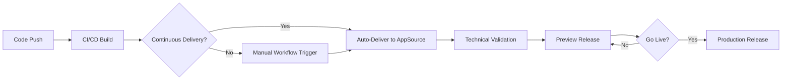

## Introduction

AL-Go for GitHub provides automated workflows for publishing Business Central applications to Microsoft AppSource. While the initial app submission must be done manually through Partner Center, AL-Go enables continuous delivery of updates to your AppSource offerings.

<Note>
  The initial creation and upload of your app on AppSource cannot be automated in AL-Go for GitHub. You must manually upload marketing materials and the first version of your app through Partner Center. After this initial setup, AL-Go can automate subsequent updates.
</Note>

## What is AppSource Publishing?

Microsoft AppSource is the official marketplace for Business Central extensions. Publishing to AppSource allows you to:

- **Reach a global audience**: Make your apps available to Business Central customers worldwide
- **Automate updates**: Use AL-Go workflows to continuously deliver app updates
- **Maintain quality**: Leverage automated validation and testing workflows
- **Manage versions**: Control preview and production releases through Partner Center integration

## Key Concepts

<CardGroup cols={2}>
  <Card title="Product ID" icon="fingerprint">
    Your AppSource Product ID uniquely identifies your offering in Partner Center. This GUID is required for AL-Go configuration and can be found in the browser address bar when viewing your app in Partner Center.
  </Card>
  
  <Card title="Continuous Delivery" icon="rotate">
    Enable automatic publishing to AppSource after successful builds. When enabled, each successful build is submitted for validation and made available as a preview release.
  </Card>
  
  <Card title="Main App & Libraries" icon="cubes">
    Your AL-Go project can contain one main AppSource app plus multiple library apps. Library apps can be shared across projects or repositories.
  </Card>
  
  <Card title="Go Live" icon="rocket">
    After an app passes validation and is available in preview, you can promote it to production either through Partner Center or by running the Publish To AppSource workflow.
  </Card>
</CardGroup>

## Repository Structure

### Single Project vs Multi-Project

AL-Go supports both repository structures for AppSource apps:

**Single Project Repository**
- One AppSource offering per repository
- Main app + library apps in the same project
- Simpler configuration and dependency management

**Multi-Project Repository**
- Multiple projects, each can contain one AppSource offering
- Shared library apps in separate projects
- Use `UseProjectDependencies` to optimize builds

<Note>
  One AL-Go project can only hold one AppSource offering (one AppSource Product ID) plus a number of library apps. If your library apps are used by multiple AppSource offerings, they should be placed in separate projects or repositories.
</Note>

## Project vs Repository Settings

AL-Go distinguishes between two types of settings files:

### Repository Settings
File: `.github/AL-Go-Settings.json`

Contains global settings that apply to all projects:
- `UseProjectDependencies`: Build library apps once and reuse across projects
- Organization-wide configuration
- Shared workflow settings

### Project Settings
File: `.AL-Go/<project>/.AL-Go-Settings.json` or `<project>/.AL-Go-Settings.json`

Contains project-specific configuration:
- `deliverToAppSource`: AppSource-specific settings including Product ID
- `mainAppFolder`: Which app folder contains the main app
- `includeDependencies`: Which dependencies to include as library apps
- `generateDependencyArtifact`: Create artifacts with dependent apps

## Prerequisites

Before setting up AL-Go for AppSource publishing, you need:

<Steps>
  <Step title="Existing AppSource App">
    Your app must already be published on AppSource. Complete the initial submission through Partner Center, including:
    - Marketing materials and app description
    - First version of your app (.app file)
    - Technical validation and certification
  </Step>
  
  <Step title="GitHub Repository">
    Create a repository based on the [AL-Go-AppSource template](https://aka.ms/AL-Go-AppSource) with your app source code.
  </Step>
  
  <Step title="AppSource Product ID">
    Locate your AppSource Product ID in Partner Center. Navigate to your app offering and copy the GUID from the browser address bar.
  </Step>
  
  <Step title="Partner Center Authentication">
    Set up authentication to Partner Center using either Service-to-Service (S2S) authentication or User Impersonation. See the [Publish Workflow](/appsource/publish-workflow) page for details.
  </Step>
</Steps>

## Publishing Workflow Overview

The AppSource publishing process in AL-Go follows these stages:



<Steps>
  <Step title="Build & Test">
    AL-Go runs the CI/CD workflow to build your apps and execute tests.
  </Step>
  
  <Step title="Delivery">
    Based on your configuration, apps are delivered to AppSource either automatically (continuous delivery) or when you manually trigger the workflow.
  </Step>
  
  <Step title="Validation">
    Microsoft's validation service checks your app for technical compliance and best practices.
  </Step>
  
  <Step title="Preview">
    Once validation passes, your app is available in AppSource as a preview release.
  </Step>
  
  <Step title="Go Live">
    Promote the preview to production either through Partner Center or by running the Publish To AppSource workflow with the GoLive parameter.
  </Step>
</Steps>

## Authentication Methods

AL-Go supports two authentication methods for Partner Center API access:

### Service-to-Service (S2S) - Recommended

Best for automated workflows and CI/CD pipelines. Requires creating a Microsoft Entra application with appropriate API permissions.

**Advantages:**
- No user interaction required
- Better for automation
- Token doesn't expire with user password changes
- Recommended for production workflows

**Requirements:**
- Microsoft Entra application registration
- Client ID and Client Secret
- Appropriate Partner Center API permissions

### User Impersonation

Uses device flow authentication with a user account. Suitable for testing or when S2S setup is not feasible.

**Advantages:**
- Easier initial setup
- No app registration required
- Good for testing and development

**Limitations:**
- Requires interactive authentication
- Tokens may expire
- Less suitable for automated workflows

<Warning>
  For production environments, Service-to-Service (S2S) authentication is strongly recommended for reliability and security.
</Warning>

## Configuration Overview

Setting up AppSource publishing requires:

1. **AppSourceContext Secret**: Contains authentication credentials for Partner Center API
2. **deliverToAppSource Settings**: Project configuration with Product ID and delivery options
3. **Dependency Configuration**: Optional settings for including library apps

Example minimal configuration:

```json
{
  "deliverToAppSource": {
    "productId": "your-product-id-guid",
    "continuousDelivery": false
  }
}
```

## Delivery Targets

AL-Go supports multiple delivery targets that can work alongside AppSource publishing:

- **AppSource**: Microsoft's official marketplace
- **Storage**: Azure Storage accounts for backup or distribution
- **NuGet/GitHub Packages**: Package feeds for library apps
- **Custom Targets**: Define your own delivery scripts

Each delivery target operates independently, allowing you to publish to multiple destinations simultaneously.

## Best Practices

<CardGroup cols={2}>
  <Card title="Start with Manual Delivery" icon="hand">
    Begin with `continuousDelivery: false` and manually trigger the workflow until you're confident in your setup.
  </Card>
  
  <Card title="Use Code Signing" icon="certificate">
    Sign your apps before publishing to AppSource. Learn more about [code signing configuration](/appsource/codesigning).
  </Card>
  
  <Card title="Test in Preview" icon="flask">
    Always validate your apps in preview mode before promoting to production.
  </Card>
  
  <Card title="Organize Library Apps" icon="books">
    Place shared library apps in separate projects or repositories for better reusability.
  </Card>
  
  <Card title="Enable Dependency Artifacts" icon="box">
    Set `generateDependencyArtifact: true` when using `includeDependencies` to properly track and include library apps.
  </Card>
  
  <Card title="Monitor Workflow Logs" icon="list-check">
    Regularly review delivery workflow logs to catch issues early.
  </Card>
</CardGroup>

## Example: BingMaps.AppSource

Microsoft provides a reference implementation at [microsoft/bcsamples-bingmaps.appsource](https://github.com/microsoft/bcsamples-bingmaps.appsource) demonstrating:

- Multi-project repository structure
- Main app with test apps
- Library app separation
- Dependency inclusion configuration
- AppSource delivery workflow

This repository serves as a practical example of AL-Go AppSource publishing in action.

## Next Steps

<CardGroup cols={2}>
  <Card title="Configure Publishing" icon="gear" href="/appsource/publish-workflow">
    Learn how to set up authentication and configure the AppSource publishing workflow
  </Card>
  
  <Card title="Enable Code Signing" icon="file-signature" href="/appsource/codesigning">
    Set up Azure Key Vault and code signing for your AppSource apps
  </Card>
</CardGroup>
