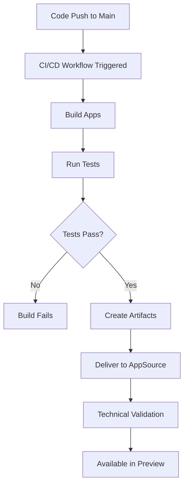

## Overview

The Publish To AppSource workflow enables automated delivery of your Business Central apps to Microsoft AppSource. This workflow integrates with the Partner Center Ingestion API to submit app updates for validation and publication.

<Note>
  Before configuring the workflow, ensure you have already published your app to AppSource manually through Partner Center. AL-Go cannot automate the initial app submission.
</Note>

## Authentication Setup

To publish to AppSource, AL-Go needs to authenticate with the Partner Center Ingestion API. You can use either Service-to-Service (S2S) authentication or User Impersonation.

### Service-to-Service (S2S) Authentication

S2S authentication is the recommended approach for automated workflows and production environments.

<Steps>
  <Step title="Create Microsoft Entra Application">
    Follow Step 1 from the [Azure Marketplace API documentation](https://docs.microsoft.com/en-us/azure/marketplace/azure-app-apis) to create a Microsoft Entra application.
    
    You will need:
    - **Client ID**: The application (client) ID from your app registration
    - **Client Secret**: A client secret created for your application
    - **Tenant ID**: Your Microsoft Entra tenant ID
  </Step>
  
  <Step title="Generate AuthContext">
    Use PowerShell with BcContainerHelper to generate the authentication context:
    
    ```powershell
    $authcontext = New-BcAuthContext `
        -clientID $PublisherAppClientId `
        -clientSecret (ConvertTo-SecureString -String $PublisherAppClientSecret -AsPlainText -Force) `
        -Scopes "https://api.partner.microsoft.com/.default" `
        -TenantID "<your-aad-tenant-id>"
    
    New-ALGoAppSourceContext -authContext $authContext | Set-Clipboard
    ```
    
    This copies the encoded authentication context to your clipboard.
  </Step>
  
  <Step title="Create AppSourceContext Secret">
    1. Navigate to your GitHub repository
    2. Go to **Settings** → **Secrets and variables** → **Actions**
    3. Click **New repository secret**
    4. Name: `AppSourceContext`
    5. Value: Paste the authentication context from your clipboard
    6. Click **Add secret**
  </Step>
</Steps>

<Warning>
  Keep your Client Secret secure. Never commit it to your repository or share it publicly. Store it only in GitHub Secrets.
</Warning>

### User Impersonation Authentication

If you cannot create a Microsoft Entra application, you can use user impersonation with device flow authentication.

<Steps>
  <Step title="Generate AuthContext with Device Flow">
    Run the following PowerShell script:
    
    ```powershell
    $authcontext = New-BcAuthContext `
        -includeDeviceLogin `
        -Scopes "https://api.partner.microsoft.com/user_impersonation offline_access" `
        -tenantID "<your-aad-tenant-id>"
    
    New-ALGoAppSourceContext -authContext $authContext | Set-Clipboard
    ```
  </Step>
  
  <Step title="Complete Device Authentication">
    The script will display a device code. Navigate to [https://aka.ms/devicelogin](https://aka.ms/devicelogin) and enter the code to authenticate.
  </Step>
  
  <Step title="Create AppSourceContext Secret">
    After authentication completes, create the `AppSourceContext` secret in GitHub using the value from your clipboard (same process as S2S).
  </Step>
</Steps>

<Note>
  User impersonation tokens may expire and require reauthentication. For production workflows, Service-to-Service authentication is more reliable.
</Note>

## Configuration

### Locate Your AppSource Product ID

Your AppSource Product ID is a GUID that uniquely identifies your app offering in Partner Center.

<Steps>
  <Step title="Open Partner Center">
    Navigate to [Partner Center](https://partner.microsoft.com/dashboard) and sign in.
  </Step>
  
  <Step title="Navigate to Your App">
    Go to your AppSource app offering in the Partner Center dashboard.
  </Step>
  
  <Step title="Copy Product ID">
    Look at the browser address bar. The Product ID is the GUID in the URL.
    
    Example URL:
    ```
    https://partner.microsoft.com/dashboard/...../products/5fbe0803-a545-4504-b41a-d9d158112360
    ```
    
    Product ID: `5fbe0803-a545-4504-b41a-d9d158112360`
  </Step>
</Steps>

### Project Settings Configuration

Add the `deliverToAppSource` configuration to your project settings file.

**File Location:**
- Single project: `.AL-Go/settings.json` or `AL-Go-Settings.json` in your project folder
- Multi-project: `.AL-Go/<project-name>/settings.json`

#### Minimal Configuration

```json
{
  "deliverToAppSource": {
    "productId": "5fbe0803-a545-4504-b41a-d9d158112360"
  }
}
```

#### Full Configuration Example

```json
{
  "deliverToAppSource": {
    "productId": "5fbe0803-a545-4504-b41a-d9d158112360",
    "continuousDelivery": false,
    "mainAppFolder": "BingMaps-AppSource",
    "includeDependencies": [
      "Freddy Kristiansen_*.app"
    ]
  },
  "generateDependencyArtifact": true
}
```

### Configuration Properties

| Property | Required | Description |
|----------|----------|-------------|
| `productId` | **Yes** | Your AppSource Product ID (GUID) from Partner Center |
| `continuousDelivery` | No | Enable automatic delivery after successful builds. Default: `false` |
| `mainAppFolder` | No | Folder name containing the main app. If not specified, AL-Go determines it automatically |
| `includeDependencies` | No | Array of patterns matching dependency apps to include as library apps |

<Note>
  The `productId` is the only mandatory field. All other properties are optional and have sensible defaults.
</Note>

### Including Library Apps

When your AppSource offering includes library apps (dependencies), configure dependency inclusion:

```json
{
  "deliverToAppSource": {
    "productId": "your-product-id",
    "includeDependencies": [
      "Contoso.*.app",
      "Publisher Name_*.app"
    ]
  },
  "generateDependencyArtifact": true
}
```

<Warning>
  When using `includeDependencies`, you must set `generateDependencyArtifact` to `true`. This creates build artifacts containing the dependent apps needed for submission.
</Warning>

#### Dependency Pattern Matching

The `includeDependencies` array accepts glob patterns:
- `*.app` - All apps
- `Publisher Name_*.app` - All apps from a specific publisher
- `Contoso.*.app` - All apps with "Contoso." prefix
- `SpecificApp_1.0.0.0.app` - Specific app and version

### Multi-Project Repository Configuration

For repositories with multiple projects:

**Repository Settings** (`.github/AL-Go-Settings.json`):
```json
{
  "useProjectDependencies": true
}
```

**Project Settings** (each project's settings file):
```json
{
  "deliverToAppSource": {
    "productId": "project-specific-product-id",
    "continuousDelivery": false,
    "mainAppFolder": "MainApp",
    "includeDependencies": [
      "SharedLibrary_*.app"
    ]
  },
  "generateDependencyArtifact": true
}
```

<Note>
  Setting `useProjectDependencies` to `true` in repository settings optimizes builds by building library apps once and reusing them across dependent projects.
</Note>

## Manual Workflow Execution

The Publish To AppSource workflow can be triggered manually to publish specific versions.

<Steps>
  <Step title="Navigate to Actions">
    Go to your repository's **Actions** tab on GitHub.
  </Step>
  
  <Step title="Select Workflow">
    Click on **Publish To AppSource** in the workflow list.
  </Step>
  
  <Step title="Run Workflow">
    Click **Run workflow** and configure the parameters:
    
    - **App version**: Which version to publish
      - `current`: Latest successful build from current branch
      - `prerelease`: Latest prerelease
      - `draft`: Latest draft release
      - `latest`: Latest release
      - Specific version number (e.g., `1.2.3.4`)
    
    - **Projects**: Which projects to publish (use `*` for all projects)
    
    - **GoLive**: Check this to automatically promote to production after validation
  </Step>
  
  <Step title="Monitor Progress">
    Watch the workflow execution in real-time. The workflow will:
    1. Initialize and read settings
    2. Authenticate to Partner Center
    3. Upload app files
    4. Submit for validation
    5. (Optional) Promote to production if GoLive is enabled
  </Step>
</Steps>

### Workflow Parameters

#### appVersion

Specifies which app version to deliver:

- **`current`** (default): Latest successful build artifact from the current branch
- **`prerelease`**: Most recent prerelease version
- **`draft`**: Most recent draft release
- **`latest`**: Most recent production release
- **Version number**: Specific version like `1.0.0.0` or `2.5.3.1`

#### projects

For multi-project repositories, specify which projects to publish:

- **`*`** (default): All projects configured with `deliverToAppSource`
- **`ProjectName`**: Single project by name
- **`Project1,Project2`**: Multiple projects, comma-separated

#### GoLive

Boolean parameter that controls promotion to production:

- **`false`** (default): Publish to AppSource as preview only
- **`true`**: Automatically promote to production after passing validation

<Warning>
  Be cautious when setting GoLive to `true`. Your app will be automatically published to production for all AppSource customers once it passes validation.
</Warning>

## Continuous Delivery

When `continuousDelivery` is enabled, AL-Go automatically publishes to AppSource after successful CI/CD builds.

### Enable Continuous Delivery

Update your project settings:

```json
{
  "deliverToAppSource": {
    "productId": "your-product-id",
    "continuousDelivery": true
  }
}
```

### Continuous Delivery Workflow



With continuous delivery:
1. Every push to your main branch triggers the CI/CD workflow
2. After successful build and tests, apps are automatically delivered to AppSource
3. AppSource runs technical validation
4. If validation passes, the app becomes available in preview mode
5. You manually promote to production via Partner Center or the GoLive workflow parameter

<Note>
  Even with continuous delivery enabled, apps are published as preview releases. You must explicitly promote them to production.
</Note>

## Delivery Process

When the workflow executes, AL-Go performs these steps:

<Steps>
  <Step title="Retrieve Build Artifacts">
    AL-Go downloads the specified app version artifacts from GitHub Actions or Releases.
  </Step>
  
  <Step title="Identify Apps">
    The workflow identifies:
    - Main app (from `mainAppFolder` or automatic detection)
    - Library apps (matching `includeDependencies` patterns)
    - Test apps (excluded from AppSource submission)
  </Step>
  
  <Step title="Authenticate to Partner Center">
    Using the `AppSourceContext` secret, AL-Go authenticates to the Partner Center Ingestion API.
  </Step>
  
  <Step title="Upload to Partner Center">
    Apps are uploaded to Partner Center:
    - Main app as the primary offering
    - Library apps as dependencies
    - Package metadata and configuration
  </Step>
  
  <Step title="Submit for Validation">
    The submission is sent for Microsoft's technical validation process.
  </Step>
  
  <Step title="Monitor Validation">
    You can monitor validation progress in Partner Center. The workflow completes after successful submission.
  </Step>
  
  <Step title="Preview or Production">
    - Without GoLive: App becomes available in preview
    - With GoLive: App is promoted to production after validation
  </Step>
</Steps>

## Monitoring Delivery

### Workflow Logs

Check the GitHub Actions workflow logs for detailed delivery information:

1. Navigate to **Actions** tab
2. Select the workflow run
3. Expand the **Deliver to AppSource** job
4. Review the logs for each step

Key information in logs:
- Authentication status
- App files being uploaded
- Submission ID
- Validation status

### Partner Center Dashboard

Monitor submission status in Partner Center:

1. Sign in to [Partner Center](https://partner.microsoft.com/dashboard)
2. Navigate to your app offering
3. Check the submission status
4. Review validation results
5. Promote to production when ready

## Troubleshooting

### Authentication Failures

**Symptom**: Workflow fails with authentication errors

**Solutions**:
- Verify `AppSourceContext` secret exists and is correctly formatted
- Check that Client ID and Client Secret are correct (for S2S)
- Ensure Microsoft Entra app has appropriate API permissions
- Verify Tenant ID is correct
- For user impersonation, reauthenticate if token expired

### Product ID Not Found

**Symptom**: Error about invalid or missing Product ID

**Solutions**:
- Verify the `productId` in your settings matches Partner Center
- Check that you copied the GUID correctly (no extra spaces)
- Ensure you're using the Product ID, not the App ID

### Validation Failures

**Symptom**: App submission fails Microsoft validation

**Solutions**:
- Review validation errors in Partner Center
- Check AppSource certification requirements
- Verify app dependencies are correctly specified
- Ensure app meets Business Central version requirements
- Review code analysis warnings and errors

### Missing Dependencies

**Symptom**: Library apps not included in submission

**Solutions**:
- Verify `generateDependencyArtifact` is set to `true`
- Check `includeDependencies` patterns match your app files
- Ensure dependency apps are built successfully
- Review artifact contents in workflow logs

### Multi-Project Issues

**Symptom**: Wrong project being published or dependencies missing

**Solutions**:
- Set `useProjectDependencies: true` in repository settings
- Run "Update AL-Go System Files" workflow after changing settings
- Verify each project has its own settings file with correct configuration
- Check that library apps are in separate projects if shared

## Example Configuration: BingMaps.AppSource

The [BingMaps.AppSource sample](https://github.com/microsoft/bcsamples-bingmaps.appsource) demonstrates a complete AppSource publishing setup:

### Repository Structure
```
bcsamples-bingmaps.appsource/
├── .github/
│   └── AL-Go-Settings.json          # useProjectDependencies: true
├── Main App/
│   ├── .AL-Go/
│   │   └── settings.json            # deliverToAppSource config
│   ├── BingMaps-AppSource/          # Main app folder
│   ├── BingMaps-AppSource.Test/     # Test app
│   └── BingMaps.Common/             # Helper app
└── Library Apps/
    └── FreddyDK.Licensing/          # Shared library
```

### Main App Settings
```json
{
  "deliverToAppSource": {
    "productId": "5fbe0803-a545-4504-b41a-d9d158112360",
    "continuousDelivery": false,
    "mainAppFolder": "BingMaps-AppSource",
    "includeDependencies": [
      "Freddy Kristiansen_*.app"
    ]
  },
  "generateDependencyArtifact": true
}
```

This configuration:
- Publishes the BingMaps-AppSource main app
- Includes the FreddyDK.Licensing library app from the Library Apps project
- Uses manual delivery (continuousDelivery: false)
- Automatically includes BingMaps.Common (referenced by main app)

## Next Steps

<CardGroup cols={2}>
  <Card title="Code Signing" icon="file-signature" href="/appsource/codesigning">
    Set up code signing with Azure Key Vault for your AppSource apps
  </Card>
  
  <Card title="AppSource Overview" icon="store" href="/appsource/overview">
    Learn more about AppSource publishing concepts and best practices
  </Card>
</CardGroup>
