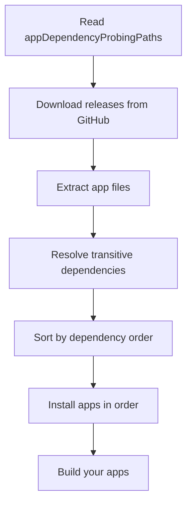

When your Business Central app depends on applications from other GitHub repositories, AL-Go can automatically download and install these dependencies during the build process. This enables modular development and code reuse across projects.

## Overview

App dependencies in AL-Go are configured using the `appDependencyProbingPaths` setting, which tells the build system where to find external apps. During CI/CD workflows, AL-Go downloads the specified apps and installs them before building your project.

<Note>
**Two-Step Process**: You must add dependencies to both:
1. The `appDependencyProbingPaths` setting in AL-Go settings
2. The `dependencies` array in your `app.json` file
</Note>

## Dependency Configuration Structure

The `appDependencyProbingPaths` setting expects a JSON array with dependency specifications:

```json
"appDependencyProbingPaths": [
  {
    "repo": "https://github.com/<Owner>/<repository name>",
    "version": "<latest, specific version>",
    "release_status": "<release, prerelease, draft>",
    "authTokenSecret": "<Secret Name>",
    "projects": "*"
  }
]
```

### Configuration Parameters

<CardGroup cols={2}>
  <Card title="repo" icon="github">
    The full GitHub URL of the repository containing the dependency app.
    
    Example: `https://github.com/myorg/base-app`
  </Card>

  <Card title="version" icon="tag">
    The version of the dependency to download. Can be:
    - `latest` - Always use the most recent version
    - Specific version like `1.0.0`, `2.3.1`
  </Card>

  <Card title="release_status" icon="circle-check">
    The type of release to download from:
    - `release` - Official releases (default)
    - `prerelease` - Pre-release versions
    - `draft` - Draft releases
  </Card>

  <Card title="authTokenSecret" icon="key">
    Name of the secret containing the GitHub access token (required for private repositories).
  </Card>

  <Card title="projects" icon="folder">
    Which projects to include from the repository:
    - `*` - All projects (default)
    - Specific project name for multi-project repos
  </Card>

  <Card title="branch" icon="code-branch">
    The branch to use (default: `main`).
    
    Use specific branches for development dependencies.
  </Card>
</CardGroup>

## Basic Example: Public Repository

To depend on apps from a public GitHub repository:

<Steps>
  <Step title="Update AL-Go settings">
    Add the dependency to your `.AL-Go/settings.json` or project-level `settings.json`:

    ```json
    {
      "appDependencyProbingPaths": [
        {
          "repo": "https://github.com/mycompany/core-library",
          "version": "latest",
          "release_status": "release",
          "projects": "*"
        }
      ]
    }
    ```
  </Step>

  <Step title="Update app.json">
    Add the dependency to your app's `app.json` file:

    ```json
    {
      "id": "12345678-1234-1234-1234-123456789012",
      "name": "My App",
      "publisher": "My Company",
      "version": "1.0.0.0",
      "dependencies": [
        {
          "id": "87654321-4321-4321-4321-210987654321",
          "name": "Core Library",
          "publisher": "My Company",
          "version": "1.0.0.0"
        }
      ]
    }
    ```
  </Step>

  <Step title="Run CI/CD">
    Commit and push your changes.

    During the CI/CD workflow, AL-Go will:
    1. Download the latest release from the specified repository
    2. Extract the app files
    3. Install them in the build container
    4. Build your app with the dependencies available
  </Step>
</Steps>

## Private Repository Dependencies

When depending on apps in private repositories, you need to provide authentication.

<Steps>
  <Step title="Create a GitHub Personal Access Token">
    Generate a Personal Access Token (PAT) with appropriate permissions:

    1. Go to GitHub **Settings** → **Developer settings** → **Personal access tokens**
    2. Click **Generate new token** (classic)
    3. Select scopes:
       - `repo` - Full control of private repositories
    4. Generate and copy the token

    <Warning>
      Store this token securely. You won't be able to see it again after leaving the page.
    </Warning>
  </Step>

  <Step title="Add the token as a secret">
    Add the PAT to your repository or Azure Key Vault:

    **GitHub Secrets**:
    1. Navigate to repository **Settings** → **Secrets and variables** → **Actions**
    2. Click **New repository secret**
    3. Name: `DEPENDENCY_ACCESS_TOKEN`
    4. Value: Your PAT
    5. Click **Add secret**

    **Azure Key Vault**:
    ```bash
    az keyvault secret set \
      --vault-name MyKeyVault \
      --name DEPENDENCY-ACCESS-TOKEN \
      --value "ghp_your_token_here"
    ```
  </Step>

  <Step title="Configure dependency with authentication">
    Update your settings to reference the secret:

    ```json
    {
      "appDependencyProbingPaths": [
        {
          "repo": "https://github.com/mycompany/private-library",
          "version": "latest",
          "release_status": "release",
          "authTokenSecret": "DEPENDENCY_ACCESS_TOKEN",
          "projects": "*"
        }
      ]
    }
    ```
  </Step>
</Steps>

## Advanced Scenarios

### Multiple Dependencies

Depend on multiple repositories:

```json
{
  "appDependencyProbingPaths": [
    {
      "repo": "https://github.com/mycompany/core-library",
      "version": "2.1.0",
      "release_status": "release",
      "projects": "*"
    },
    {
      "repo": "https://github.com/mycompany/ui-framework",
      "version": "latest",
      "release_status": "prerelease",
      "projects": "*"
    },
    {
      "repo": "https://github.com/partner/integration-app",
      "version": "1.0.0",
      "release_status": "release",
      "authTokenSecret": "PARTNER_ACCESS_TOKEN",
      "projects": "*"
    }
  ]
}
```

### Specific Project in Multi-Project Repository

If the dependency repository contains multiple AL-Go projects, specify which one:

```json
{
  "appDependencyProbingPaths": [
    {
      "repo": "https://github.com/mycompany/multi-app-repo",
      "version": "latest",
      "release_status": "release",
      "projects": "BaseApp"
    }
  ]
}
```

### Development Branch Dependencies

<Warning>
**Not Recommended for Production**: Using branch-based dependencies instead of releases can lead to unstable builds. Use only for active development scenarios.
</Warning>

```json
{
  "appDependencyProbingPaths": [
    {
      "repo": "https://github.com/mycompany/experimental-features",
      "version": "latest",
      "release_status": "latestBuild",
      "branch": "feature/new-api",
      "projects": "*"
    }
  ]
}
```

## Version Management

### Latest vs. Specific Versions

<CardGroup cols={2}>
  <Card title="latest" icon="arrow-up">
    **Pros**: Always get bug fixes and improvements automatically
    
    **Cons**: Breaking changes might cause build failures
    
    **Best for**: Internal dependencies you control
  </Card>

  <Card title="Specific Version" icon="lock">
    **Pros**: Stable, predictable builds
    
    **Cons**: Must manually update to get fixes
    
    **Best for**: External dependencies, production apps
  </Card>
</CardGroup>

### Update Strategy

<Steps>
  <Step title="Pin to specific versions initially">
    Start with specific version numbers for stability:

    ```json
    "version": "1.2.3"
    ```
  </Step>

  <Step title="Test updates in a branch">
    When a new version is available:
    1. Create a feature branch
    2. Update to the new version
    3. Run full CI/CD to verify compatibility
    4. Merge if successful
  </Step>

  <Step title="Use semantic versioning awareness">
    Understand version impact:
    - **Patch** (1.2.3 → 1.2.4): Bug fixes, safe to update
    - **Minor** (1.2.3 → 1.3.0): New features, usually safe
    - **Major** (1.2.3 → 2.0.0): Breaking changes, test thoroughly
  </Step>
</Steps>

## Dependency Resolution

AL-Go downloads and installs dependencies in this order:



<Note>
**installOnlyReferencedApps**: By default (when `installOnlyReferencedApps` is `true`), AL-Go only installs apps that are in your dependency chain. Set to `false` to install all apps found in the probing paths.
</Note>

## Best Practices

### Dependency Hygiene

1. **Keep dependencies minimal**: Only depend on what you actually use
2. **Document dependencies**: Comment why each dependency is needed
3. **Review regularly**: Remove unused dependencies
4. **Version appropriately**: Use specific versions for stability

### Security

<Warning>
**Protect Access Tokens**: Always store GitHub PATs in GitHub Secrets or Azure Key Vault, never in code or settings files.
</Warning>

- Use read-only tokens when possible
- Create separate tokens for different dependency sources
- Rotate tokens periodically
- Audit token usage

### Build Performance

```json
{
  "installOnlyReferencedApps": true,
  "appDependencyProbingPaths": [
    {
      "repo": "https://github.com/mycompany/large-app-collection",
      "version": "1.0.0",
      "release_status": "release",
      "projects": "CoreOnly"
    }
  ]
}
```

- Use `installOnlyReferencedApps: true` to avoid unnecessary installations
- Specify exact projects instead of `*` when possible
- Pin to specific versions to enable caching
- Consider creating focused dependency repositories

### Testing

<Steps>
  <Step title="Test dependency updates in isolation">
    Create a branch specifically for testing new dependency versions.
  </Step>

  <Step title="Run full test suite">
    Ensure all tests pass after updating dependencies.
  </Step>

  <Step title="Verify in development environment">
    Deploy to a development environment and test manually.
  </Step>

  <Step title="Monitor for issues">
    After merging, watch CI/CD runs closely for any dependency-related problems.
  </Step>
</Steps>

## Troubleshooting

### Dependency Not Found

**Symptom**: Build fails with "app not found" or "dependency not resolved"

**Solutions**:
- Verify the repository URL is correct
- Check that a release exists with the specified version
- Ensure the release contains app artifacts
- Verify the release status matches your configuration
- Check authentication if it's a private repository

### Authentication Failures

**Symptom**: "Failed to download" or "403 Forbidden" errors

**Solutions**:
- Verify the secret name matches `authTokenSecret`
- Check the PAT has `repo` scope
- Ensure the PAT hasn't expired
- Verify the PAT user has access to the repository

### Version Conflicts

**Symptom**: Build fails with version mismatch errors

**Solutions**:
- Check all dependencies use compatible versions
- Review transitive dependencies (dependencies of dependencies)
- Update `app.json` version requirements to match available versions
- Consider using `updateDependencies` setting (with caution)

## Next Steps

<CardGroup cols={2}>
  <Card title="Versioning Strategy" icon="code-branch" href="./versioning">
    Learn about version numbering and release management in AL-Go
  </Card>

  <Card title="Development Environments" icon="laptop-code" href="./dev-environments">
    Set up online development environments for testing dependencies
  </Card>
</CardGroup>
