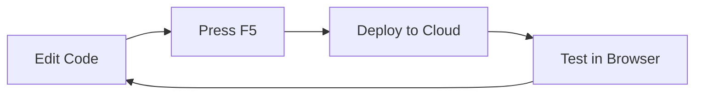

Online development environments enable rapid application development by providing cloud-based Business Central sandboxes configured specifically for your AL-Go project. These environments integrate seamlessly with VS Code for debugging and testing.

## Overview

AL-Go supports two methods for creating online development environments:

<CardGroup cols={2}>
  <Card title="From VS Code" icon="code">
    Run a PowerShell script locally to create and configure an environment directly from your development machine.
  </Card>

  <Card title="From GitHub" icon="github">
    Use a GitHub Actions workflow to create environments through automated processes.
  </Card>
</CardGroup>

<Note>
**Important**: Two developers cannot share a single online environment. Each developer needs their own dedicated environment.
</Note>

## Create Environment from VS Code

This method uses a PowerShell script to create an environment with interactive authentication.

<Steps>
  <Step title="Run the cloudDevEnv script">
    Open your AL-Go project in VS Code and navigate to the `.AL-Go` folder.

    Locate and run the `cloudDevEnv.ps1` script.

    ```powershell
    ./.AL-Go/cloudDevEnv.ps1
    ```

    The script will prompt you for:
    - **Environment name** (if not specified as a parameter)
    - Whether to **reuse** or **recreate** the environment if it already exists
  </Step>

  <Step title="Authenticate with device code flow">
    The script needs access to the Business Central Admin Center API and initiates a device code login.

    When prompted:
    1. Open [https://aka.ms/devicelogin](https://aka.ms/devicelogin) in your browser
    2. Enter the code displayed in the PowerShell terminal
    3. Sign in with your Business Central admin credentials
    4. Accept the PowerShell authentication request
  </Step>

  <Step title="Wait for environment setup">
    The script performs several operations:
    - Creates or reuses the specified environment
    - Compiles all apps in your project
    - Publishes apps to the online environment using development scope
    - Configures VS Code launch.json for the new environment

    <Note>
      This process may take several minutes depending on the number of apps and dependencies.
    </Note>
  </Step>

  <Step title="Start developing">
    Once the script completes, VS Code is ready for rapid application development:

    1. Make changes to your app code
    2. Press **F5** to debug
    3. Select the **Cloud Sandbox** with your environment name
    4. Your changes are immediately available in the online environment

    The `launch.json` file is updated with your new environment. You can choose to:
    - Commit the changes to share the environment configuration
    - Keep it local for personal use only
  </Step>
</Steps>

## Create Environment from GitHub

This method uses GitHub Actions workflows to create environments, useful for automated or unattended setup.

### Authentication Setup

The workflow requires authentication to the Business Central Admin Center API.

<Warning>
**Admin Center API Credentials Required**: You must provide authentication credentials either as a GitHub Secret or in Azure Key Vault.
</Warning>

#### Option 1: Unattended Authentication

For fully automated workflow execution, create a secret called `AdminCenterApiCredentials`.

<Steps>
  <Step title="Generate a refresh token">
    On a machine with BcContainerHelper installed, run:

    ```powershell
    New-BcAuthContext -includeDeviceLogin | New-ALGoAuthContext | Set-Clipboard
    ```

    This copies a JSON authentication context to your clipboard.
  </Step>

  <Step title="Create the GitHub secret">
    Navigate to your repository **Settings** → **Secrets and variables** → **Actions**.

    Create a new secret named `AdminCenterApiCredentials` with the format:

    ```json
    {"refreshtoken":"your_refresh_token_here"}
    ```

    <Note>
      At the time of writing, the Admin Center API does not support S2S authentication, so the refresh token format is required.
    </Note>
  </Step>
</Steps>

#### Option 2: Interactive Device Flow

If you don't provide the `AdminCenterApiCredentials` secret, the workflow initiates a device code flow.

<Steps>
  <Step title="Start the workflow without credentials">
    Run the **Create Online Dev. Environment** workflow without the secret configured.

    The workflow pauses and waits for authentication.
  </Step>

  <Step title="Get the device code">
    Inspect the workflow run details and open the job:
    
    **Check AdminCenterApiCredentials / Initiate Device Login (open to see code)**

    The device code is displayed in the job logs.
  </Step>

  <Step title="Complete authentication">
    1. Navigate to [https://aka.ms/devicelogin](https://aka.ms/devicelogin)
    2. Enter the device code from the workflow logs
    3. Sign in with admin credentials
    4. The workflow continues automatically after successful authentication
  </Step>
</Steps>

### Run the Workflow

<Steps>
  <Step title="Start the workflow">
    On GitHub.com, navigate to **Actions** → **Create Online Dev. Environment**.

    Click **Run workflow** and provide:
    - **Environment name**: Name for your development environment
    - **Reuse environment**: Whether to reuse an existing environment with the same name

    Click **Run workflow** to start.
  </Step>

  <Step title="Review the pull request">
    When the workflow completes, it creates a pull request with changes to `launch.json`.

    The pull request includes:
    - New launch configuration for the online environment
    - Server URL and authentication settings
    - Environment-specific configuration

    ```json
    {
      "type": "al",
      "request": "launch",
      "name": "Your Online Dev Environment",
      "server": "https://businesscentral.dynamics.com",
      "environmentName": "YourEnvName",
      "tenant": "your-tenant-id"
    }
    ```
  </Step>

  <Step title="Merge and start developing">
    Review and merge the pull request.

    Developers can now:
    1. Pull the latest changes to get the updated launch.json
    2. Use the new environment for debugging and development
    3. Press F5 in VS Code to connect to the online environment
  </Step>
</Steps>

## Development Workflow with Online Environments

### Rapid Application Development (RAD)

Online environments enable a fast development cycle:



<Steps>
  <Step title="Make code changes">
    Edit your AL code in VS Code as usual.
  </Step>

  <Step title="Debug in the cloud">
    Press **F5** and select your online environment from the launch configuration list.

    VS Code:
    - Compiles your changes
    - Publishes to the development scope
    - Launches the debugger attached to the online environment
  </Step>

  <Step title="Test immediately">
    Your changes are live in the Business Central web client.

    Test functionality, verify UI changes, and debug issues in real-time.
  </Step>

  <Step title="Iterate quickly">
    Make additional changes and press F5 again.

    No need to rebuild containers or wait for local environment startup.
  </Step>
</Steps>

## Best Practices

### Environment Management

<CardGroup cols={2}>
  <Card title="One Environment Per Developer" icon="user">
    Each developer should have their own dedicated environment to avoid conflicts and ensure isolation.
  </Card>

  <Card title="Name Environments Clearly" icon="tag">
    Use descriptive names like "dev-johnsmith" or "feature-newcheckout" to identify purpose and owner.
  </Card>

  <Card title="Clean Up Unused Environments" icon="trash">
    Delete environments when features are complete or developers leave the team to save resources.
  </Card>

  <Card title="Separate Dev and Test" icon="layer-group">
    Keep development environments separate from formal test/staging environments.
  </Card>
</CardGroup>

### Security Considerations

<Warning>
**Protect Refresh Tokens**: The `AdminCenterApiCredentials` secret contains sensitive authentication tokens. Store it securely in GitHub Secrets or Azure Key Vault, never in code.
</Warning>

- Use Azure Key Vault for production setups
- Rotate refresh tokens periodically
- Limit who can access the secrets
- Audit secret usage regularly

### Launch Configuration Management

**Local vs. Committed**:

- **Commit** launch.json changes to share environment configurations with the team
- Keep **local** if the environment is for personal development only
- Use `.gitignore` to exclude personal launch configurations if needed

```json
// .vscode/launch.json - Can be committed for team use
{
  "configurations": [
    {
      "name": "Team Dev Environment",
      "type": "al",
      "request": "launch",
      "environmentName": "TeamDev"
    }
  ]
}
```

### Performance Tips

<Note>
**Apps published in development scope** load faster and can be unpublished easily. This is ideal for rapid iteration during development.
</Note>

- Keep test data sets reasonably sized
- Archive old development environments instead of deleting
- Use the "reuse environment" option when possible to save setup time
- Monitor environment performance and upgrade if needed

## Troubleshooting

### Authentication Issues

If device code login fails:
- Verify you have Business Central admin rights
- Check that your tenant allows the Admin Center API
- Ensure you're using a work/school account, not a personal Microsoft account
- Try clearing browser cache and cookies

### Environment Creation Fails

Common issues:
- **Insufficient licenses**: Ensure you have available development licenses
- **Name conflicts**: Use a unique environment name
- **Region restrictions**: Verify your tenant supports the selected region
- **Quota limits**: Check if you've reached environment limits

### Connection Problems

If VS Code can't connect:
- Verify the environment is running in Business Central Admin Center
- Check launch.json has correct server and tenant information
- Ensure your account has access to the environment
- Try regenerating the authentication context

## Next Steps

<CardGroup cols={2}>
  <Card title="Configure Dependencies" icon="link" href="./dependencies">
    Learn how to set up dependencies on apps from other repositories
  </Card>

  <Card title="Versioning Strategy" icon="code-branch" href="./versioning">
    Understand version numbering and release management
  </Card>
</CardGroup>
